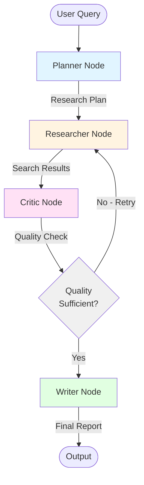

# The Oracle - Architecture Diagram

## State Flow

1. **Planner**: Analyzes user query, generates structured research plan (sub-queries, search terms)
2. **Researcher**: Executes searches via Tavily API (with retries), aggregates results
3. **Critic**: Evaluates result quality (freshness, bias, completeness), decides if refinement needed
4. **Writer**: Synthesizes final report from approved research results

## Recursive Loop Guard

- Maximum iterations: 3 cycles (Planner → Researcher → Critic → Researcher)
- Quality threshold: Critic must score >= 0.7 to proceed
- Exponential backoff: If quality fails, wait before retry
