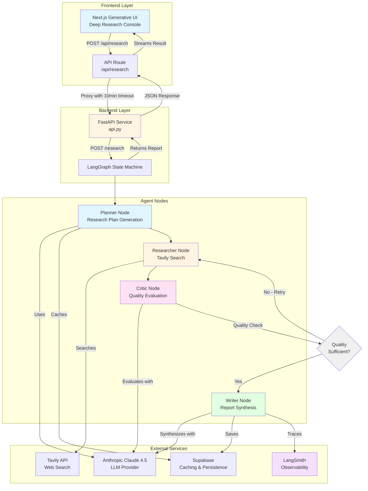

# ResearchAgentv2 - System Architecture

## High-Level Architecture

## Agent State Machine Flow

## Component Details

### Frontend (Next.js)
- **Location**: `research-client/`
- **UI**: Terminal-style interface (black background, green monospace)
- **Features**:
  - Non-blocking long-running requests (up to 10 minutes)
  - `requestAnimationFrame` timer (prevents browser throttling)
  - Framer Motion fade-in animations
  - React Markdown rendering with error boundaries
  - Real-time execution timer

### Backend API (FastAPI)
- **File**: `api.py`
- **Deployment**: Google Cloud Run
- **Features**:
  - Health check endpoint (`/health`)
  - Research endpoint (`/research`)
  - 10-minute timeout support
  - Structured error handling
  - LangSmith tracing integration

### Agent Nodes

1. **Planner Node** (`nodes/planner.py`)
   - Analyzes user query
   - Generates structured research plan
   - Detects technical/academic queries
   - Injects domain filters (arxiv.org, github.com, etc.)
   - Caches plans in Supabase

2. **Researcher Node** (`nodes/researcher.py`)
   - Executes searches via Tavily API
   - Filters blacklisted domains (Medium, LinkedIn, etc.)
   - Applies domain whitelisting for technical queries
   - Aggregates results with retry logic

3. **Critic Node** (`nodes/critic.py`)
   - Evaluates research quality (freshness, bias, completeness)
   - Scores quality (0-1)
   - Determines if refinement needed
   - Implements recursive loop guard

4. **Writer Node** (`nodes/writer.py`)
   - Synthesizes final report from approved research
   - Formats with citations
   - Calculates confidence score
   - Persists to Supabase

## State Flow

1. **Planner**: Analyzes user query, generates structured research plan (sub-queries, search terms, domain filters)
2. **Researcher**: Executes searches via Tavily API (with retries), aggregates results, filters spam
3. **Critic**: Evaluates result quality (freshness, bias, completeness), decides if refinement needed
4. **Writer**: Synthesizes final report from approved research results

## Recursive Loop Guard

- **Maximum iterations**: 3 cycles (Planner → Researcher → Critic → Researcher)
- **Quality threshold**: Critic must score >= 0.7 to proceed
- **Timeout**: 10 minutes for Cloud Run deployment
- **Error handling**: Structured errors (Retryable vs Fatal)

## Observability

- **LangSmith**: Full trace of all LLM calls, node transitions, metadata
- **Structured Logging**: JSON logs with PII redaction
- **Error Tracking**: Categorized errors with full tracebacks
- **Performance Metrics**: Latency tracking per node

## Deployment Architecture

- **Backend**: Docker container on Google Cloud Run
- **Frontend**: Next.js on Vercel (or similar)
- **Database**: Supabase (PostgreSQL) for caching and persistence
- **Monitoring**: LangSmith for observability

## Data Flow

1. User submits query via Next.js UI
2. Frontend API route proxies to FastAPI backend (with 10min timeout)
3. FastAPI instantiates LangGraph and executes agent
4. Agent nodes execute sequentially with recursive refinement
5. Final report returned to FastAPI
6. FastAPI returns JSON response
7. Frontend displays result with fade-in animation
