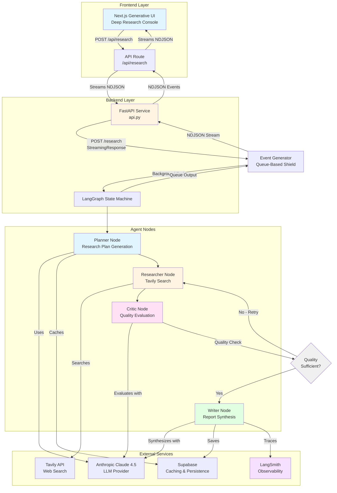

# ResearchAgentv2 - System Architecture

## High-Level Architecture



## Agent State Machine Flow


## Component Details

### Frontend (Next.js)
- **Location**: `research-client/`
- **UI**: Terminal-style interface (black background, green monospace)
- **Features**:
  - Non-blocking long-running requests (up to 10 minutes)
  - `requestAnimationFrame` timer (prevents browser throttling)
  - Framer Motion fade-in animations
  - React Markdown rendering with error boundaries
  - Real-time execution timer

### Backend API (FastAPI)
- **File**: `api.py`
- **Deployment**: Google Cloud Run
- **Features**:
  - Health check endpoint (`/health`) for Cloud Run probes
  - Streaming research endpoint (`/research`) with NDJSON format
  - **Queue-based event generator**: Shields LangGraph from client disconnects
  - CORS enabled for frontend integration
  - 10-minute timeout support (configurable)
  - Structured error handling with full tracebacks
  - LangSmith tracing integration (always finalizes)

### Agent Nodes

1. **Planner Node** (`nodes/planner.py`)
   - Analyzes user query
   - Generates structured research plan
   - Detects technical/academic queries
   - Injects domain filters (arxiv.org, github.com, etc.)
   - Caches plans in Supabase

2. **Researcher Node** (`nodes/researcher.py`)
   - Executes searches via Tavily API
   - Filters blacklisted domains (Medium, LinkedIn, etc.)
   - Applies domain whitelisting for technical queries
   - Aggregates results with retry logic

3. **Critic Node** (`nodes/critic.py`)
   - Evaluates research quality (freshness, bias, completeness)
   - Scores quality (0-1)
   - Determines if refinement needed
   - Implements recursive loop guard

4. **Writer Node** (`nodes/writer.py`)
   - Synthesizes final report from approved research
   - Formats with citations
   - Calculates confidence score
   - Persists to Supabase

## State Flow

1. **Planner**: Analyzes user query, generates structured research plan (sub-queries, search terms, domain filters)
2. **Researcher**: Executes searches via Tavily API (with retries), aggregates results, filters spam
3. **Critic**: Evaluates result quality (freshness, bias, completeness), decides if refinement needed
4. **Writer**: Synthesizes final report from approved research results

## Recursive Loop Guard

- **Maximum iterations**: 3 cycles (Planner → Researcher → Critic → Researcher)
- **Quality threshold**: Critic must score >= 0.7 to proceed
- **Timeout**: 10 minutes for Cloud Run deployment
- **Error handling**: Structured errors (Retryable vs Fatal)

## Observability

- **LangSmith**: Full trace of all LLM calls, node transitions, metadata
- **Structured Logging**: JSON logs with PII redaction
- **Error Tracking**: Categorized errors with full tracebacks
- **Performance Metrics**: Latency tracking per node

## Deployment Architecture

- **Backend**: Docker container on Google Cloud Run
- **Frontend**: Next.js on Vercel (or similar)
- **Database**: Supabase (PostgreSQL) for caching and persistence
- **Monitoring**: LangSmith for observability

## Data Flow

1. **User submits query** via Next.js UI
2. **Frontend API route** (Edge runtime) proxies to FastAPI backend
3. **FastAPI** creates `event_generator` with queue-based architecture:
   - Starts LangGraph in background task (`asyncio.create_task`)
   - LangGraph outputs are queued (`asyncio.Queue`)
   - Main generator reads from queue and yields NDJSON events
4. **Agent nodes execute** sequentially with recursive refinement:
   - Planner → Researcher → Critic → (loop if needed) → Writer
5. **Events streamed** as NDJSON:
   - `{"type": "log", "content": "...", "node": "planner"}\n`
   - `{"type": "result", "report": {...}}\n`
   - `{"type": "done"}\n`
6. **Frontend parses** NDJSON line-by-line and updates UI in real-time
7. **Result displayed** with fade-in animation

## Streaming Architecture

### Queue-Based Event Generator

The `event_generator` in `api.py` uses a **queue-based architecture** to decouple LangGraph from the HTTP stream:

```python
# LangGraph runs in background task (cannot be killed by disconnect)
graph_task = asyncio.create_task(run_graph())

# Main generator reads from queue (isolated from LangGraph)
while True:
    item = await queue.get()
    # Yield NDJSON events to client
```

**Benefits**:
- **GeneratorExit isolation**: Client disconnects never reach LangGraph's generator
- **Guaranteed completion**: LangGraph always finishes, even if client disconnects
- **LangSmith compatibility**: Traces always finalize (green checkmark)
- **Real-time progress**: Client sees updates as nodes execute

### NDJSON Event Format

- **`log`**: Progress updates (`{"type": "log", "content": "...", "node": "planner"}`)
- **`result`**: Final report (`{"type": "result", "report": {...}}`)
- **`error`**: Error messages (`{"type": "error", "error": "..."}`)
- **`done`**: Completion signal (`{"type": "done"}`)

### Frontend Streaming

- **Edge Runtime**: Next.js API route uses `export const runtime = "edge"`
- **Stream Piping**: Directly pipes backend response body to frontend
- **Line-by-line parsing**: Uses `TextDecoder` and `ReadableStream` reader
- **Real-time updates**: Updates UI state as events arrive
