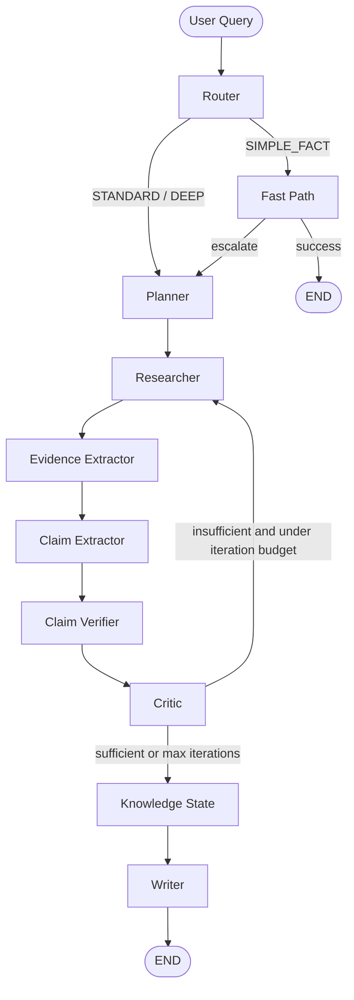

# ResearchAgentv2 — System Architecture (Phase 2D)

This document describes the **implemented** architecture through Phase 2D (Knowledge State). Items in [docs/roadmap.md](roadmap.md) are not implemented unless explicitly marked here.

## High-Level System

```mermaid
graph TB
    subgraph Frontend
        UI[Next.js Deep Research Console]
        APIRoute[/api/research Edge proxy]
    end

    subgraph Backend
        FastAPI[api.py — NDJSON streaming]
        Graph[LangGraph StateGraph — graph.py]
    end

    subgraph External
        Claude[Anthropic Claude]
        Tavily[Tavily Search]
        LangSmith[LangSmith Tracing]
        Supabase[Supabase PostgreSQL]
    end

    UI --> APIRoute --> FastAPI --> Graph
    Graph --> Claude
    Graph --> Tavily
    Graph --> LangSmith
    Graph --> Supabase
```

## Agent Graph (Implemented)


```mermaid
flowchart TD
    START([User Query]) --> ROUTER[Router]

    ROUTER -->|SIMPLE_FACT| FAST[Fast Path]
    ROUTER -->|STANDARD / DEEP| PLANNER[Planner]

    FAST -->|success| END1([END])
    FAST -->|escalate| PLANNER

    PLANNER --> RESEARCHER[Researcher]
    RESEARCHER --> EVIDENCE[Evidence Extractor]
    EVIDENCE --> CLAIMS[Claim Extractor]
    CLAIMS --> VERIFIER[Claim Verifier]
    VERIFIER --> CRITIC[Critic]

    CRITIC -->|insufficient and under iteration budget| RESEARCHER
    CRITIC -->|sufficient or max iterations| KS[Knowledge State]
    KS --> WRITER[Writer]
    WRITER --> END2([END])
```

### Route: SIMPLE_FACT (frozen)

Narrow factual questions bypass the full research pipeline:

```
Question → Fact Target → Targeted Search → Decisive Evidence
       → Structured Fact Value → Validation → Canonical Claim → Concise Answer
```

Implemented in `services/fast_path.py`, `services/fact_target.py`, `services/fact_value.py`, `nodes/fast_path.py`. On failure, escalates to the STANDARD/DEEP path at Planner.

### Route: STANDARD / DEEP

Full evidence-grounded pipeline with configurable research budgets (`services/query_router.py`).

## Trusted Research Chain

```
SOURCE
  → VALIDATED EVIDENCE
  → DIRECT ATOMIC CLAIM
  → MATERIAL CLAIM
  → CROSS-SOURCE VERIFICATION
  → KNOWLEDGE STATE
  → REPORT
```

Every cited fact in the Writer report should trace: **Answer → Evidence → Source → URL**. Claims and verifications provide structured provenance; Knowledge State summarizes epistemic status per material claim.

## Query Routing

`services/query_router.py` classifies each query:

| Route | Typical use | Budget highlights |
|-------|-------------|-------------------|
| `simple_fact` | Capital, winner, revenue, CEO, date | 1 search, ~3 sources, 0 critic iterations |
| `standard` | Summaries, multi-part facts | 3 searches, ~8 sources, 1 iteration |
| `deep` | Comparisons, strategy, causal | 5 searches, more sources, 2 iterations |

Output: `QueryClassification` stored in `state.query_classification` with a `ResearchBudget` (search caps, claim depth, evidence caps, `max_iterations`).

## Node Responsibilities

| Node | File | Role |
|------|------|------|
| Router | `nodes/router.py` | Classify query; set route and budget |
| Fast Path | `nodes/fast_path.py` | SIMPLE_FACT answer or escalation |
| Planner | `nodes/planner.py` | Sub-queries, search terms, domain filters |
| Researcher | `nodes/researcher.py` | Tavily search, spam filter, source normalization |
| Evidence Extractor | `nodes/evidence_extractor.py` | Verbatim passages + integrity validation |
| Claim Extractor | `nodes/claim_extractor.py` | Atomic claims, materiality, origin SUPPORTS links |
| Claim Verifier | `nodes/claim_verifier.py` | Cross-source SUPPORTS / CONTRADICTS / QUALIFIES |
| Critic | `nodes/critic.py` | Evidence quality; refinement loop guard |
| Knowledge State | `nodes/knowledge_state.py` | Deterministic epistemic buckets (Phase 2D) |
| Writer | `nodes/writer.py` | Evidence-grounded report with `[E#]` citations |

## Evidence Layer (Phase 2A)

- **Source normalization**: `services/source_normalizer.py` — Tavily hits → `Source` entities
- **Extraction**: `services/evidence_pipeline.py`, `services/evidence_extractor.py`
- **Validation**: `services/evidence_validator.py` — span integrity (exact / normalized / fuzzy match)
- **Output**: `validated_evidence[]` with provenance (`source_id`, locator, match type)

## Claim Layer (Phase 2B)

- **Pipeline**: `services/claim_pipeline.py` — LLM candidates → deterministic support check → relevance → batch validation → dedup
- **Materiality**: `services/claim_relevance.py` — filters to `material_claims`
- **Origin links**: `claim_evidence_relations` with `SUPPORTS` only at extraction time

### Claim–evidence relationships

| Relationship | Meaning |
|--------------|---------|
| `supports` | Evidence substantiates the claim |
| `contradicts` | Evidence conflicts with the claim |
| `qualifies` | Evidence narrows or conditions the claim |
| `contextualizes` | Reserved; not used in current verification aggregation |

## Cross-Source Verification (Phase 2C)

`services/claim_verification.py` — **material claims only**.

1. Preserves origin `SUPPORTS` from claim extraction
2. Selects cross-source evidence (excludes origin evidence IDs and origin publisher domains)
3. Classifies additional pairs deterministically, then batched LLM for ambiguous cases
4. Aggregates to `VerificationResult` per claim

### Verification statuses

| Status | Typical meaning |
|--------|-----------------|
| `supported` | 2+ independent publisher domains support; no contradicts |
| `partially_supported` | Single-source or qualified support |
| `uncertain` | Credible support and contradict coexist |
| `contradicted` | Contradict without support |
| `insufficient_evidence` | No meaningful relevant evidence links |
| `unverifiable` | Claim type not verifiable from documentary evidence |

**Publisher-domain independence** uses `source.metadata["domain"]`. Same domain on different URLs counts as one publisher — an approximation, not true source lineage.

## Knowledge State (Phase 2D)

`services/knowledge_state.py` — **derived layer, no LLM**.

Runs only on **final Critic exit** (sufficient or max iterations), before Writer. **Not** derived during researcher refinement loops.

### Inputs

- `material_claims`
- `verification_results`
- `claim_evidence_relations`
- `critique.unsupported_areas` (information gaps only)

### Buckets

| Bucket | Derivation |
|--------|------------|
| `known` | `supported` + `high` confidence → persisted `knowledge_category = known` |
| `likely` | `partially_supported` → `likely` |
| `disputed` | `uncertain` → `disputed` |
| `unknown` | `insufficient_evidence` → `unknown` |
| `contradicted` | `contradicted` status; `knowledge_category` left `null` |
| `unverifiable` | `unverifiable` status; `knowledge_category` left `null` |
| `information_gaps` | Critic `unsupported_areas` as gap hints (`source = critic_unsupported_area`) |

Entries reference `claim_id`, `verification_id`, `relation_ids`, `evidence_ids` — **no claim text duplication**.

Orphan material claims (no matching `VerificationResult`) are **not** classified as UNKNOWN; they increment `orphan_material_claims` in metrics.

### Fast-path limitation

Successful SIMPLE_FACT runs bypass Claim Verifier and **do not** receive Knowledge State in the current MVP.

## AgentState

Defined in `state.py` as a LangGraph `TypedDict`. Key fields:

| Area | Fields |
|------|--------|
| Routing | `query_classification`, `fast_path_metrics`, `escalate_to_standard`, `escalated_from_fast_path` |
| Artifacts | `normalized_sources`, `validated_evidence`, `validated_claims`, `material_claims`, `claim_evidence_relations`, `verification_results`, `knowledge_state` |
| Control | `critique`, `iteration_count`, `current_node`, `research_sufficient` |
| Output | `final_report` |
| Metrics | `evidence_metrics`, `claim_metrics`, `verification_metrics`, `cost_metrics`, `report_metrics` |

Domain entities live in `domain/models.py` (`Source`, `Evidence`, `Claim`, `ClaimEvidenceRelation`, `VerificationResult`, etc.).

## Persistence (Supabase)

Optional — controlled by `SUPABASE_URL` / `SUPABASE_KEY`. When disabled, in-memory negative IDs are used.

### Tables

| Table | Purpose |
|-------|---------|
| `research_runs` | Run lifecycle, metadata snapshot (includes `knowledge_state`) |
| `sources` | Normalized search hits |
| `evidence` | Validated passages |
| `claims` | Atomic claims |
| `claim_evidence` | Claim ↔ evidence relationships |
| `verifications` | Per-claim verification + `knowledge_category` (known/likely/disputed/unknown) |
| `research_reports` | Final reports (legacy + optional `research_run_id` link) |

Legacy cache tables (`research_plans`, etc.) remain in `db/schema.sql`. Evidence foundation tables are in `db/migrations/001_evidence_foundation.sql`.

Repositories: `db/evidence_repositories.py`, `db/repository.py`.

**Note:** There is no full caching system for evidence or claims. Plan caching (`ENABLE_CACHING`) applies to research plans only.

## Observability

- **LangSmith**: `utils/observability.py` — `trace_llm_call` spans per node/operation
- **Structured logging**: JSON logs with PII redaction (`utils/pii_redaction.py`)
- **Per-stage metrics**: `*_metrics` dicts on state; `cost_metrics` aggregates run-level counters including knowledge-state counts

## Streaming API

`api.py` uses a queue-based NDJSON event generator:

- LangGraph runs in a background task
- Events: `log`, `result`, `error`, `done`
- Client disconnects do not kill the graph run (LangSmith traces finalize)

See [README.md](../README.md) for deployment and entry points.

## Known Limitations (Current)

- Writer does **not** consume `verification_results` or `knowledge_state`
- Critic does **not** consume verification results
- Successful fast-path runs have no Knowledge State
- Publisher-domain independence is approximate
- Cross-domain `supported` / `known` depends on retrieval yielding diverse sources
- No Decision Engine, monitoring, or change detection

## Testing

```bash
uv run pytest   # 178 tests, no live LLM for core logic
```

Phase validation scripts (manual / constrained live):

- `scripts/validate_phase_2a5_e2e.py` — evidence
- `scripts/validate_phase_2b_e2e.py` — claims
- `scripts/validate_phase_2b7_e2e.py` — fast path
- `scripts/validate_phase_2c_e2e.py` — verification
- `scripts/validate_phase_2d_e2e.py` — knowledge state
